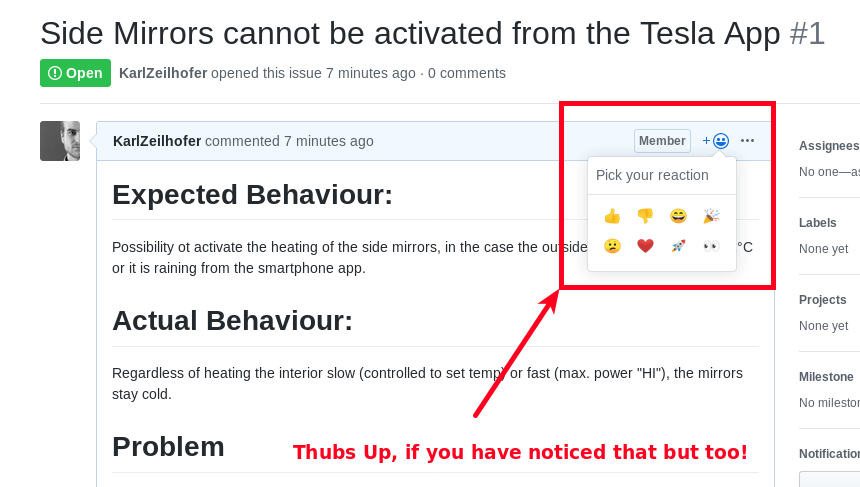

# Bug Tracker for Tesla Model 3

This repository is used only for its issue tracker. 

Tesla Motors Inc. doesn't provide any official way to report software problems publicly. 

Let's try to collect them here in a coordinated way as far as possible. 

## Reporting Style
* Expected Behaviour
* Actual Behaviour
* Problem
* Details of car inkl. Software version

## Contribution
If you have noticed a reported problem too, please give the issue a thubs up!

